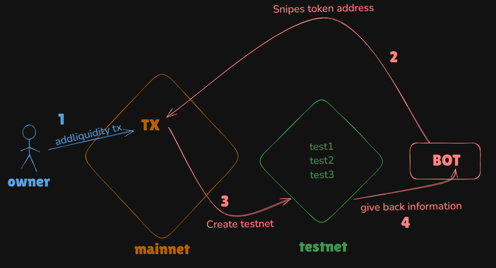
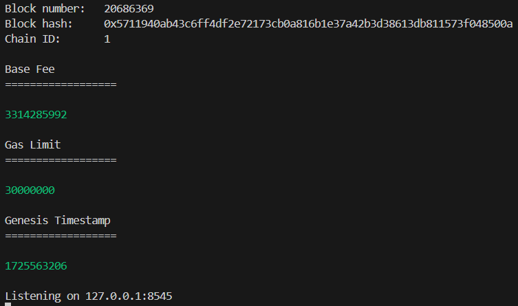
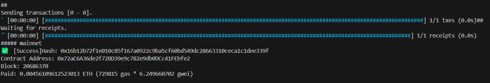
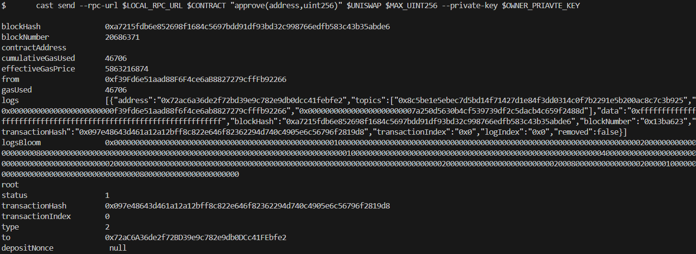
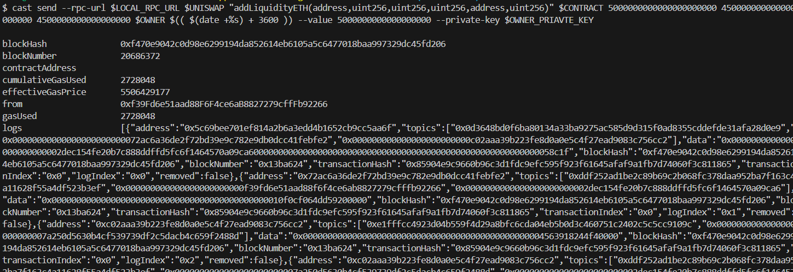
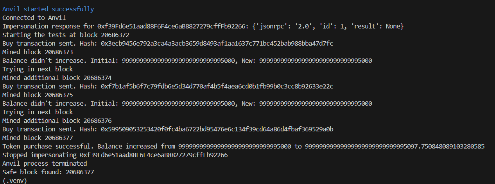

# PROJECT EXPLANATION

The purpose of this project is to monitor mempool transactions and respond accordingly. For example, you can buy a token as soon as a specific owner adds liquidity. Additionally, the project allows for testing a token before purchasing it. This is done by listening for liquidity events and, once the owner adds liquidity, creating a mainnet fork to perform various tests on the token before making a purchase. You will need to adjust the scripts to suit your specific goals. For instance, I modified the scripts to test which block a random user can buy the token.  
To test this, I created an ERC20 token in `src/Shell.sol` and deployed it on my testnet. Then, I started monitoring for the owner adding liquidity, and once liquidity was added, I created a fork of my testnet to test the token before making a purchase.




## Prerequisites

- Python 3.8+
- [Foundry](https://book.getfoundry.sh/getting-started/installation)

## Setup

1. Clone the repository:
   ```sh
   git clone https://github.com/Shellboxe/web3-challs
   cd web3-challs
   ```

2. Create and activate a virtual environment:
   ```sh
   python -m venv .venv
   source .venv/bin/activate  # On Windows, use `.venv\Scripts\activate`
   ```

3. Install the required Python packages:
   ```sh
   pip install -r requirements.txt
   ```

4. Set up environment variables:
   Create a `.env` file in the root directory and add the following:
   ```bash
    MAINNET_RPC_URL=https://eth-pokt.nodies.app	
    OWNER=0xf39Fd6e51aad88F6F4ce6aB8827279cffFb92266
    OWNER_PRIVATE_KEY=0xac0974bec39a17e36ba4a6b4d238ff944bacb478cbed5efcae784d7bf4f2ff80
    ETHERSCAN_API_KEY=YourApiKey

    BUYER=0x70997970C51812dc3A010C7d01b50e0d17dc79C8
    LOCAL_RPC_URL=http://127.0.0.1:8545

    CONTRACT=DeployedContractAddress
    UNISWAP=0x7a250d5630B4cF539739dF2C5dAcb4c659F2488D

    MAX_UINT256=115792089237316195423570985008687907853269984665640564039457584007913129639935
   ```

5. Install Foundry dependencies:
   ```sh
   cd foundry_repo
   forge install OpenZeppelin/openzeppelin-contracts
   ```

## Liquidity Sniping Simulation Explanation

This code setup can be particularly useful for simulating and analyzing liquidity sniping scenarios, for example when a developer is about to launch a new ERC20 token using the `addLiquidityETH` function. Here's how it works:

1. **Scenario**: You know the address of the token owner but not the token address itself.

2. **Mempool Monitoring**: The `mempool.py` script sets up a listener that monitors the mempool for `addLiquidityETH` transactions initiated by the known owner address.

3. **Fork Simulation**: When the listener detects the relevant transaction, it triggers the creation of a forked network using Anvil. This allows you to simulate and analyze potential outcomes without affecting the main network.

4. **Custom Simulation**: In this example, the token will block transactions in the first 4 blocks after adding liquidity. The `simulation.py` script (called from `mempool.py`) is set up to anticipate this scenario.

5. **Flexibility**: You can modify the scripts and classes to simulate various scenarios or strategies based on your specific needs or hypotheses.

6. **Network Setup**: 
   - The mainnet is represented by `127.0.0.1:8545`
   - The forked network for simulation runs on port 7545

This setup allows you to test and refine sniping strategies, analyze potential vulnerabilities, or study the behavior of new token launches in a controlled environment before interacting with the real mainnet.

## Demonstration

   1. Start Anvil in the first terminal (terminal1):
      ```sh
      anvil --fork-url $MAINNET_RPC_URL
      ```
      

   2. Open a separate terminal (terminal2) and run:
      ```sh
      forge script script/Token.s.sol:TokenScript --rpc-url $LOCAL_RPC_URL --broadcast
      ```
      this deploys the shell token (make sure to add the contract address to .env and run `source .env`):
      


   3. Open another terminal (terminal3) and run:
      ```sh
      python python-scripts/mempool.py $OWNER --rpc-url $LOCAL_RPC_URL
      ```
      now what you did here is that you listen to mempool sniping liquidity method of the owner

   4. In the previous terminal, run:
      ```sh
      cast send --rpc-url $LOCAL_RPC_URL $CONTRACT "approve(address,uint256)" $UNISWAP $MAX_UINT256 --private-key $OWNER_PRIAVTE_KEY
      cast send --rpc-url $LOCAL_RPC_URL $UNISWAP "addLiquidityETH(address,uint256,uint256,uint256,address,uint256)" $CONTRACT 5000000000000000000000 450000000000000000000 4500000000000000000 $OWNER $(( $(date +%s) + 3600 )) --value 5000000000000000000 --private-key $OWNER_PRIAVTE_KEY
      ```
      this simulates that the owner has added liquidity 
      APPROVAL :
      
      ADDLIQUIDITY :
      

      Now go back to the mempool terminal to visualize the simulation.
      

      We found the safe block to buy from **20686377**

7. Ensure the variables in `.env` are set up correctly. The `$OWNER` is the first address provided by Anvil, and the `$CONTRACT` variable should be filled with the deployed contract's address , copy it after you deploy it and paste it in .env .

## Project Structure

- `anvil.py`: Manages interactions with the Anvil Ethereum simulator.
- `cast.py`: Utilities for working with contract ABIs and function calls.
- `mempool.py`: Monitors the Ethereum mempool for transactions.
- `simulation.py`: Runs simulations of Ethereum transactions and contract interactions; it doesn't work standalone.
- `tools.py`: Various utility functions for the project.


